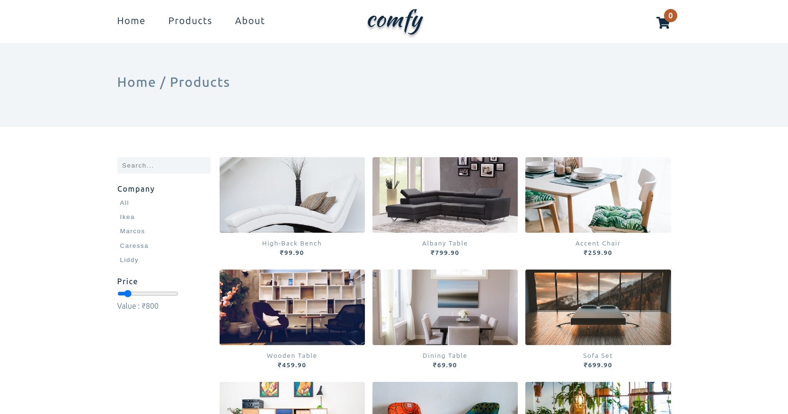
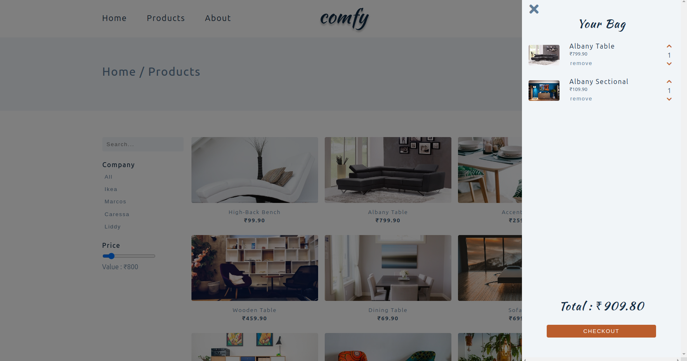

# 🛋️ Comfy - The Furniture Paradise


> *Transform your space with style - A fully functional furniture e-commerce experience built with pure vanilla JavaScript*

<div align="center">


**[🚀 Live Demo](https://comfy-neon.vercel.app/index.html) | [📖 Documentation](#features) | [🛠️ Installation](#installation)**

</div>

---

## ✨ **What Makes This Special?**

This isn't just another furniture website - it's a **complete e-commerce experience** crafted with passion and precision using **pure vanilla JavaScript**. No frameworks, no dependencies, just clean, efficient code that delivers a seamless shopping experience.

## 🎯 **Key Highlights**

- 🎨 **Pure Vanilla JavaScript** - No frameworks, maximum performance
- 🛒 **Complete Shopping Cart** - Add, remove, and manage items effortlessly  
- 💰 **Smart Price Filtering** - Find furniture within your budget instantly
- 🔍 **Intelligent Search** - Discover products with lightning-fast search
- 📱 **Fully Responsive** - Perfect experience on any device
- 🏷️ **Product Deep Dive** - Detailed about pages for every item
- ⚡ **Lightning Fast** - Optimized for speed and performance

---

## 🚀 **Features**

### 🛍️ **Shopping Experience**
- **Add to Cart Functionality** - Seamless cart management with real-time updates
- **Product Catalog** - Beautifully structured product listings
- **Individual Product Pages** - Comprehensive details for each furniture piece
- **Cart Persistence** - Your selections stay even after page refresh

### 🔧 **Advanced Filtering & Search**
- **Price Range Filter** - Slide to set your budget, see instant results
- **Dynamic Search** - Type and watch products filter in real-time
- **Category Filtering** - Browse by furniture type with ease
- **Multi-Filter Support** - Combine filters for precise results

### 💡 **User Experience**
- **Responsive Design** - Flawless experience across all devices
- **Fast Loading** - Optimized performance with vanilla JavaScript
- **Intuitive Navigation** - User-friendly interface design
- **Clean Architecture** - Well-organized code structure

---

## 🛠️ **Installation**

Get started in just 3 simple steps:

```bash
# 1. Clone the repository
git clone https://github.com/mailmeatdarshan/Comfy.git

# 2. Navigate to project directory
cd Comfy

# 3. Open in your browser
open index.html
```

**That's it!** No npm install, no build process, no complexity. Just pure web technology at work.

---

## 🎮 **How to Use**

### 🛒 **Shopping Made Simple**
1. **Browse Products** - Explore our curated furniture collection
2. **Filter by Price** - Use the price slider to match your budget
3. **Search Products** - Type in the search bar for instant results
4. **View Details** - Click any product for comprehensive information
5. **Add to Cart** - Hit the cart button to add items
6. **Manage Cart** - Review and modify your selections

### 🔍 **Pro Tips**
- Use **multiple filters** simultaneously for precise results
- **Product pages** contain detailed specifications and images
- **Cart updates** happen in real-time without page refresh
- **Search works** across product names, categories, and descriptions

---

## 🌟 **Why Vanilla JavaScript?**

| **Advantage** | **Benefit** |
|---------------|-------------|
| ⚡ **Performance** | Lightning-fast loading with zero framework overhead |
| 🎯 **Control** | Complete control over every aspect of functionality |
| 📦 **Lightweight** | Minimal file size, maximum efficiency |
| 🔧 **Maintainable** | Clean, readable code that's easy to understand |
| 🚀 **Future-Proof** | Built on web standards that won't become obsolete |

---

## 📸 **Screenshots**






---

## 🔮 **Future Enhancements**

- 💳 Payment integration
- 👤 User authentication
- ⭐ Product reviews and ratings
- 📦 Order tracking
- 🎨 Theme customization
- 📱 Progressive Web App (PWA) features

---

## 🤝 **Contributing**

We love contributions! Here's how you can help:

1. 🍴 Fork the repository
2. 🌟 Create a feature branch (`git checkout -b feature/amazing-feature`)
3. 💾 Commit your changes (`git commit -m 'Add amazing feature'`)
4. 📤 Push to the branch (`git push origin feature/amazing-feature`)
5. 🎉 Open a Pull Request

---

## 📄 **License**

This project is licensed under the MIT License - see the [LICENSE](LICENSE) file for details.

---

## 🙏 **Acknowledgments**

- Built with ❤️ using pure web technologies
- Inspired by modern e-commerce best practices
- Designed for furniture enthusiasts everywhere

---

<div align="center">

### 🌟 **Star this repo if you found it helpful!** 🌟

**Made with 🛋️ by Dubey for Dub-loper**

*Crafting digital experiences, one line of code at a time*

</div>

---

**Ready to transform your space? Start exploring the collection now!** 🚀